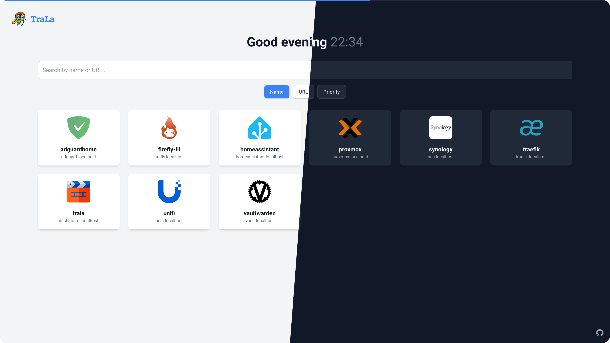

# TraLa - Traefik Landing Page

A simple, modern, and dynamic dashboard for your Traefik services. This application automatically discovers services via the Traefik API and displays them in a clean, responsive grid. It's designed to be run as a lightweight, multi-arch Docker container.



## ✨ Features

- **Auto-Discovery:** Automatically fetches and displays all HTTP routers from your Traefik instance.
- **Advanced Icon Fetching:** Intelligently finds the best icon for each service using a robust, prioritized strategy.
- **Icon Overrides:** Manually map router names to specific icons for perfect results every time.
- **Modern UI:** Clean, responsive interface with automatic Light/Dark mode based on your OS settings.
- **Live Search & Sort:** Instantly filter and sort your services by name, URL, or priority.
- **External Search:** Use the search bar to quickly search the web with your configured search engine.
- **Lightweight & Multi-Arch:** Built with Go and a minimal Alpine base, the Docker image is small and compatible with `amd64` and `arm64` architectures.
- **Service Exclusion:** Hide specific services from the dashboard using router name exclusions.

---

## 🚀 Getting Started

The easiest way to get started is by using the pre-built Docker image from the GitHub Container Registry.

### `docker-compose.yml` (Recommended)

This is the recommended approach. Add this service to your existing `docker-compose.yml` file.

```yaml
version: '3.8'

services:
  traefik:
    image: "traefik:v3.0"
    # ... your existing traefik configuration ...
    command:
      # ...
      - "--api.insecure=true" # Required for the dashboard to access the API
    networks:
      - traefik-net # A shared network

  trala:
    image: ghcr.io/dannybouwers/trala:latest
    container_name: trala
    restart: unless-stopped
    networks:
      - traefik-net # Must be on the same network as Traefik
    volumes:
      # Optional: Mount a local file to override icons. See "Icon Overrides" section below.
      - ./icon_overrides.yml:/config/icon_overrides.yml:ro
      # Optional: Mount a local file to exclude services. See "Service Exclusion" section below.
      - ./services.yml:/config/services.yml:ro
    environment:
      # Required: The internal Docker network address for the Traefik API
      - TRAEFIK_API_HOST=http://traefik:8080
      # Optional: Change refresh interval
      - REFRESH_INTERVAL_SECONDS=30
      # Optional: Change the search engine
      - SEARCH_ENGINE_URL=https://duckduckgo.com/?q=
      # Optional: Set to "debug" for verbose icon-finding logs
      - LOG_LEVEL=info
    labels:
      # --- Traefik Labels to expose TraLa itself ---
      - "traefik.enable=true"
      - "traefik.http.routers.trala.rule=Host(`trala.your-domain.com`)"
      - "traefik.http.routers.trala.entrypoints=websecure"
      - "traefik.http.routers.trala.tls=true"
      - "traefik.http.services.trala.loadbalancer.server.port=8080"
      - "traefik.http.services.trala.loadbalancer.server.scheme=http"


networks:
  traefik-net:
    driver: bridge
```

---

## ⚙️ Icon Overrides (Advanced)

While TraLa does its best to find the right icon, fuzzy search isn't perfect. For ultimate control, you can provide an `icon_overrides.yml` file. This is the most powerful feature for customizing your dashboard.

### How It Works

The application uses the **router name** from your Traefik configuration (the part before the `@`) as the primary identifier for a service. You can map this router name to either:

1. A full URL to an icon (e.g., `https://selfh.st/content/images/2023/09/favicon-1.png`)
2. A specific icon filename from the [selfh.st icon repository](https://selfh.st/icons/)

**This override has the highest priority.** If a router name is found in this file, TraLa will use the specified icon and skip all other detection methods.

When using a filename from the selfh.st icon repository, you can specify files with the following extensions:

- `.png` (default if no extension specified)
- `.svg`
- `.webp`

The application will automatically construct the appropriate URL based on the file extension

### Creating the `icon_overrides.yml`

1. Create a file named `icon_overrides.yml` on your Docker host.
2. Use the following simple YAML format:

    ```yaml
    # icon_overrides.yml
    # Format: <traefik_router_name>: <icon_url_or_filename>

    # Example 1: Using a full URL
    firefly-core: https://selfh.st/content/images/2023/09/favicon-1.png

    # Example 2: Using a filename with .png extension
    unifi-controller: ubiquiti-unifi.png

    # Example 3: Using a filename with .svg extension
    home-assistant: home-assistant.svg

    # Example 4: Using a filename with .webp extension
    plex: plex.webp
    ```

3. Mount this file into the container at `/config/icon_overrides.yml` using a volume, as shown in the `docker-compose.yml` example.

---

## 🚫 Service Exclusion (Advanced)

You can hide specific services from appearing in the dashboard by specifying their router names in a `services.yml` configuration file. This is useful for hiding administrative interfaces or services you don't want to be easily accessible through the dashboard.

### How It Works

The application uses the **router name** from your Traefik configuration (the part before the `@`) to identify services. By adding router names to the exclusion list, those services will not be processed or displayed in the dashboard.

### Creating the `services.yml`

1. Create a file named `services.yml` on your Docker host.
2. Use the following YAML format:

    ```yaml
    # services.yml
    # Format: List router names to exclude from the dashboard
    service:
      exclude:
        # Example 1: Exclude the Traefik API router
        - traefik-api
        
        # Example 2: Exclude a private admin interface
        - private-admin-panel
    ```

3. Mount this file into the container at `/config/services.yml` using a volume, as shown in the `docker-compose.yml` example.

---

## 🔒 Secure Traefik API Access (Advanced)

Instead of using `--api.insecure=true` in your Traefik configuration, you can create a dedicated router for the API. This approach is more secure as it allows fine-grained control over API access.

### How It Works

If TraLa is deployed in the same Docker network as Traefik, the router should also work within the network. This can be accomplished by adding the internal Traefik hostname as a host in the router of Traefik.

### Example Configuration

```yaml
version: '3.8'

services:
  traefik:
    image: "traefik:v3.0"
    hostname: traefik # <-- specify the hostname for this container
    # ... your existing traefik configuration ...
    command:
      # ...
      - --api # Secure API
      - --entrypoints.web.address=:80
      # - ...
    labels:
      # ...
      # Dashboard & API
      - traefik.http.routers.traefik-api.entrypoints=web
      - traefik.http.routers.traefik-api.rule=Host(`traefik`) && PathPrefix(`/api`) # <-- use the container hostname in the router rule
      - traefik.http.routers.traefik-api.service=api@internal

  trala:
    # ... your existing traefik configuration ...
    environment:
      - TRAEFIK_API_HOST=http://traefik # <-- specify the hostname of the traefik container and the port of the entrypoint (if not protocol default)
```

With this configuration, you can remove the `--api.insecure=true` flag from your Traefik configuration, making your setup more secure. TraLa will automatically ignore the service created for connecting to Traefik's API.

---

## 🔧 Configuration

The application is configured using environment variables:

| Variable                   | Description                                                                                             | Default                                | Required |
| -------------------------- | ------------------------------------------------------------------------------------------------------- | -------------------------------------- | -------- |
| `TRAEFIK_API_HOST`         | The full base URL of your Traefik API. From within Docker, this is typically `http://traefik:8080`.        | `(none)`                               | **Yes** |
| `REFRESH_INTERVAL_SECONDS` | The interval in seconds at which the service list automatically refreshes.                                | `30`                                   | No       |
| `SEARCH_ENGINE_URL`        | The URL for the external search engine. The search query will be appended to this URL.                    | `https://www.google.com/search?q=`     | No       |
| `LOG_LEVEL`                | Set to `debug` for verbose logging of the icon-finding process. Any other value is silent.              | `info`                                 | No       |

---

## 🛠️ Building Locally

If you want to build the image yourself:

1. **Clone the repository:**

    ```bash
    git clone https://github.com/dannybouwers/trala.git
    cd trala
    ```

2. **Build the Docker image:**

    ```bash
    docker build -t trala .
    ```

3. **Run the locally built image:**

    ```bash
    docker run -d -p 8080:8080 -e TRAEFIK_API_HOST="http://<your-traefik-ip>:8080" trala
    ```

---

## 📜 License

This project is licensed under the MIT License. See the `LICENSE` file for details.

---

## 🙏 Acknowledgements

This project was developed in close collaboration with Google's Gemini. I provided the architectural direction, feature requirements, and debugging, while Gemini handled the bulk of the code generation. This transparent, AI-assisted approach allowed for rapid development and iteration.

Special thanks to:

- **[Maria Letta](https://github.com/MariaLetta/free-gophers-pack)** for the wonderful Gopher logo used in the application.
- **[selfh.st/icons](https://selfh.st/icons/)** for providing the extensive, high-quality icon database that powers the service icon discovery.
