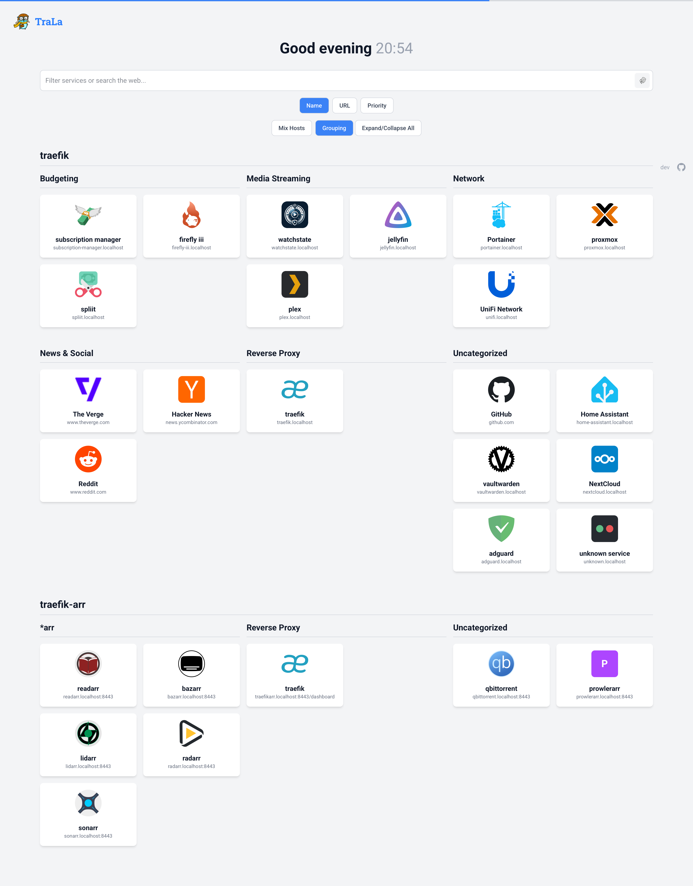
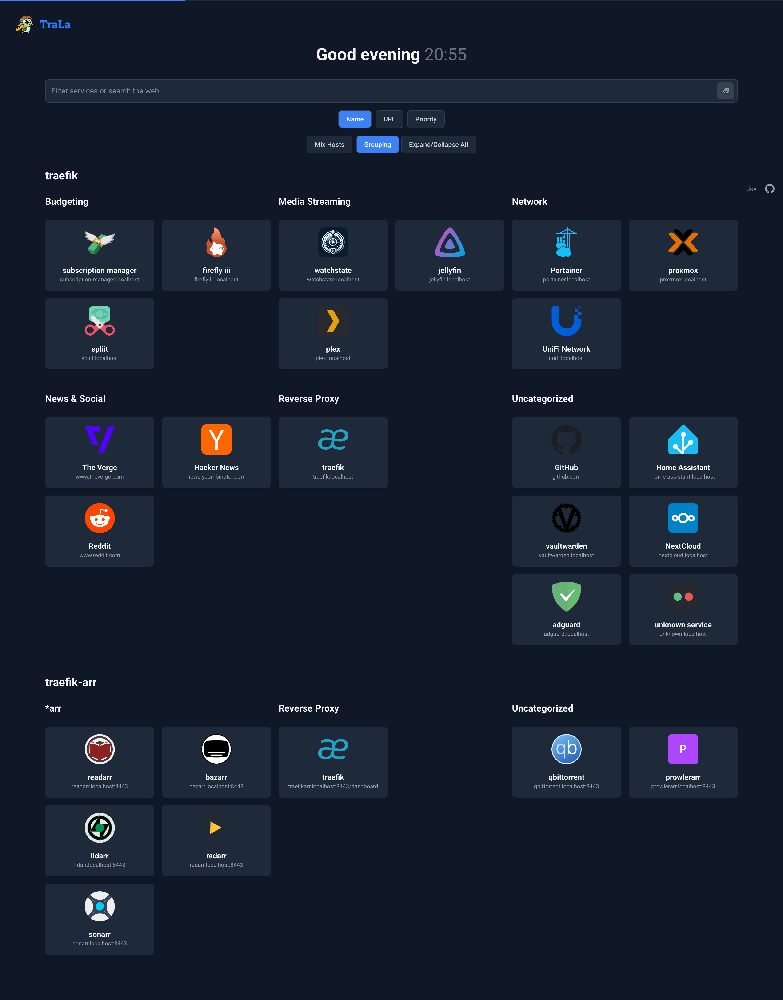

# TraLa

A modern, dynamic dashboard for Traefik services.

## ✨ Features

- **Auto-Discovery** — Automatically fetches and displays all HTTP routers from Traefik
- **Icon Auto-Detection** — Intelligently finds icons using selfh.st/icons
- **Smart Grouping** — Automatically group services based on tags
- **Light/Dark Mode** — Automatic theme based on OS settings
- **Manual Services** — Add custom services not managed by Traefik
- **Multi-Language** — Available in English, German, and Dutch
- **Multi-Arch** — Built for amd64 and arm64 architectures

## Screenshots





## 🚀 Quick Start

```yaml
services:
  trala:
    image: ghcr.io/dannybouwers/trala:latest
    environment:
      - TRAEFIK_API_HOST=http://traefik:8080
```

For the full documentation, visit **[trala.fyi](https://www.trala.fyi)**.

## 📖 Documentation

- [Quick Start](docs/README.md)
- [Setup](docs/setup.md)
- [Configuration](docs/configuration.md)
- [Services](docs/services.md)
- [Grouping](docs/grouping.md)
- [Icons](docs/icons.md)
- [Search](docs/search.md)
- [Security](docs/security.md)

## 🤝 Contributing

Contributions are welcome! Please read the [development guide](docs/development.md) for setup instructions.

## 📜 License

MIT License — see the [LICENSE](LICENSE) file for details.

## 🙏 Acknowledgements

This project was started to experience AI-assisted coding. It was initially developed in close collaboration with Google's Gemini. I provided the architectural direction, feature requirements, and debugging, while Gemini handled the bulk of the code generation. I've shared my experience in [this GitHub discussion](https://github.com/dannybouwers/trala/discussions/3).

I continued coding using [Kilo Code](https://kilo.ai), supported by mainly Qwen3, GLM, Grok Code and Mistral Devstral.

Special thanks to:

- **[Maria Letta](https://github.com/MariaLetta/free-gophers-pack)** for the wonderful Gopher logo used in the application.
- **[Ethan Sholly](https://github.com/shollyethan)** for providing the extensive, high-quality icon and apps database at [selfh.st](https://selfh.st) that powers the service icon discovery.